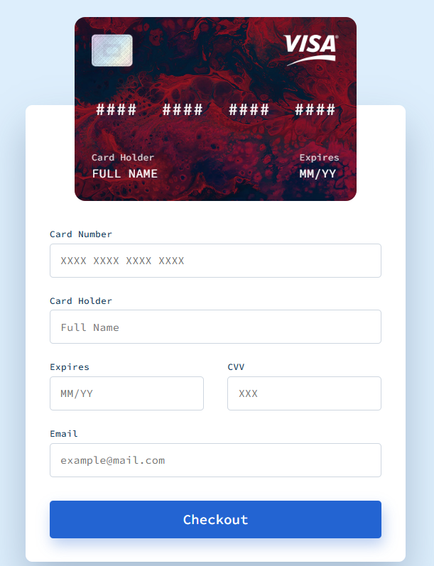

# Credit Card Form JS

A simple and responsive credit card form in JavaScript with validation, automatic card type detection, interactive card preview and more. Inspired by [muhammed/interactive-card](https://github.com/muhammed/interactive-card).

## Disclaimer

THIS IS A PERSONAL EDUCATIONAL PROJECT. The creator of this project is NOT affiliated with any company or brand in any way. This project DOES NOT collect or process any user data.

## Demo

You can check out a live demo [here](https://denyschr.github.io/credit-card-form-js/).

## Screenshots

